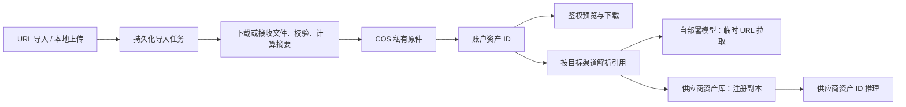

# New API 参考资产自有存储方案 v1（讨论稿）

日期：2026-09-13。源码核验基线：当前工作区 HEAD `a31b65276`。

本文是方案，不代表功能已经实现、COS 已配置或自部署模型已联调。腾讯云对象存储产品名为 COS；OSS 通常指阿里云对象存储。

实施进度：统一托管及可配置 MB 免费额度的第一版代码已经加入工作区；实际支持范围、启用方式和待联调事项以 [接入说明](asset-storage-cos-setup.md) 为准。本文中的后台导入队列、批量历史迁移和 GPU worker 续期协议仍属于后续设计。

## 1. 建议决策

在现有资产库中增加平台托管原件，以腾讯云 COS 作为第一种存储实现。继续使用 `asset://asset-na-...` 作为账户内的稳定资产引用；渠道副本表示供应商侧注册结果，自部署模型通过托管原件读取图片、音频和视频。

核心交付标准：转存成功后，原始 URL 失效也不影响预览、下载、自部署推理及后续供应商副本创建。平台存储状态不能由供应商的 Active/Failed 状态决定。

第一版支持 URL 导入、本地文件上传、历史资产转存、一个自部署模型协议的完整接入。优先覆盖显式创建的参考资产，并把该自部署协议的直接 URL 输入接入同一托管流程。生成结果归档、全供应商自动导入、多存储后端、CDN、跨区域灾备和自动转码放到后续版本。

## 2. 已核验的现状

| 现有实现 | 对本次需求的影响 |
| --- | --- |
| `model/asset_library.go` 的 `UserAsset` 保存 SourceURL、媒体属性、账户和分组；`UserAssetReplica` 单独保存渠道副本 | 可以扩展现有资产模型，不必建立第二套资产库 |
| `controller/asset_library.go:createAssetLibraryAsset` 接收 URL，校验媒体、创建逻辑记录，再调用渠道复制 | 当前创建流程没有自有原件持久化阶段 |
| `service/asset_library_media.go:inspectDownloadedAssetLibraryMedia` 下载到临时文件，解析后删除 | 可以复用下载及解析能力，但需把同一份已验证文件上传至 COS 后再释放 |
| `service/asset_library_backend.go` 创建供应商资产时读取 SourceURL；API 结果 URL 也来自 SourceURL | 供应商回填与客户端访问都需要统一的原件地址解析入口 |
| `middleware/asset_library.go:AssetLibraryRouting` 只允许所有引用均有就绪渠道副本的渠道 | 没有供应商资产库的自部署渠道会被排除；必须同时修改路由条件 |
| `service/asset_library.go:RewriteAssetReferences` 将平台 ID 改写为供应商 ID | 需要增加将平台 ID 解析为托管文件访问地址的路径 |
| `GetAssetLibraryAggregateState` 基于供应商副本推导状态，未存在副本时默认 Processing | 已存入 COS、无供应商副本的资产也应能独立就绪 |
| `PrepareAssetReferences` 已在部分 Seedance 路径做 URL 自动导入 | 目前受渠道资产库配置控制，不能直接当作平台通用托管入口 |
| `docs/asset-library-timing.md` 和相关源码已有下载、校验、持久化、供应商调用时间轴 | 扩展 COS 上传及后台任务阶段，沿用关联 ID 和脱敏方式 |

代码图工具本轮不可用，上述结论依据当前源码直接核验。未运行服务或连接真实 COS。

## 3. 资产关系与状态

三种信息分开表达：平台资产身份、平台原件存储、供应商渠道副本。COS 是平台存储配置，不伪装为一个模型渠道，也不占用供应商副本表。

原件存储状态建议为 `pending → importing → ready / failed → deleting → deleted`。失败记录保留安全错误及可重试信息；只有完整上传并核对对象大小、校验结果，数据库提交成功后才进入 ready。

现有供应商副本状态继续独立显示。新增 StorageStatus，不再用一个 Active 状态同时表达“平台有文件”和“某供应商已接受文件”。是否可在某个模型上使用，由原件/副本状态和模型输入能力共同判断。

## 4. 导入与上传

### URL 转存

1. 鉴权、校验账户分组、URL、媒体类型及存储配额；同一数据库事务创建资产和导入任务，返回资产 ID、任务 ID 及处理中状态。接口明确表示接收成功，不表示转存成功。
2. 后台任务受限并发领取工作，通过受保护下载链路抓取；校验重定向、DNS/实际连接目标、最大字节数及超时。
3. 流式落临时文件，计算 SHA-256，解析真实媒体类型与属性，上传同一份已验证内容。避免“先检查 URL，随后重新下载另一份内容”。
4. 使用不可变对象 key 上传 COS，完成传输校验及对象核验；事务提交对象定位、摘要、媒体元数据和 ready 状态。
5. 按既有配置触发供应商复制。复制失败只影响对应供应商可用性，不撤销平台托管成功。

导入任务应优先执行，避免源 URL 在队列中到期。URL 已失效应返回可识别失败并允许重新提供来源；不能宣称已保存。临时文件只用于单次执行，任务恢复不能假设其他实例可访问本机磁盘。

### 本地文件

第一版提供受限 multipart 上传：New API 接收文件，校验并写入 COS，完成持久化后再确认上传成功；后续副本复制异步执行。以当前参考资产规模控制请求大小和并发，不在内存中缓存整段视频。客户端断线及服务重启通过任务记录和对象核对处理。

大文件/高并发阶段再引入浏览器直传 COS：上传凭证限定到独立暂存 key，完成后由服务端核验真实对象并生成不可变正式对象。不能只相信客户端“上传完成”或 Content-Type；不能让仍有效的上传凭证改写已经通过校验的原件。腾讯提供 [Go SDK 预签名接口](https://cloud.tencent.com/document/product/436/35059)。

### 媒体校验

沿用现有解析能力，但将平台通用安全限制与供应商输入限制分开。目前资产库含图片 30 MiB、视频 200 MiB、音频 15 MiB，以及时长/尺寸/格式等约束，明显包含现有资产库的业务要求。平台托管需要明确自己的允许范围；提交到具体模型时再校验该模型限制。第一版可以采用保守上传上限，但不要将 Seedance 的全部尺寸和时长规则定义为所有自部署模型规则。

## 5. 推理与路由

渠道通过适配器能力声明如何消费参考资产：供应商资产 ID、HTTPS 文件 URL，或不支持该类型。该能力与“是否配置供应商资产库同步”分开，不根据是否存在 COS 配置猜测所有渠道都支持文件 URL。

路由逐个判断引用：用户必须拥有该资产；ID 模式要求该渠道副本 ready；URL 模式要求平台原件 ready 且渠道支持对应媒体类型。对全部资产取可用渠道交集，并继续应用模型、分组、权限和容量等既有路由约束。

选定渠道后，由统一解析入口生成最终输入。供应商复制也从这个入口取得托管原件的临时下载地址，不把临时地址回写 SourceURL。重试切换渠道时，从稳定资产引用重新解析，不能复用前一个渠道的供应商 ID 或过期 URL。

自部署视频协议第一版覆盖图片、音频、视频的实际参考字段；按协议字段映射，不递归改写所有字符串。原有供应商专有 URI 验证边界继续保持，不能允许其他账户或外部任意供应商 ID 绕过校验。

直接 URL 请求进入自部署模型时，先完成托管再提交推理，转存失败则请求/任务明确失败，不静默继续依赖外部 URL。耗时导入不无限阻塞同步 HTTP；沿用目标视频协议的异步任务响应，内部增加准备资产阶段，任务中持久化稳定资产 ID 与内容摘要。

自部署 worker 应在实际开始拉取时，使用受认证、绑定任务和资产集合的接口获取临时 URL。排队记录只保存任务 ID 和资产 ID；URL 到期可重新获取。若第一阶段模型服务只能接受提交时给定的 URL，则需要明确最长排队与下载窗口并据此签名、测试，不能随意设置固定十分钟。

COS Go SDK 支持按对象生成有时效的下载签名；临时凭证生成的 URL 还受凭证剩余有效期约束。长期保存的是对象定位，不是签名链接。参考 [Go SDK 预签名 URL](https://cloud.tencent.com/document/product/436/35059)。

资产准备与推理执行状态分别记录。转存失败不视为模型成功，不产生视频生成成功结算；若流程已经预扣或占用容量，按现有失败路径释放/退款。实施时需要核验目标视频协议的实际预扣位置。

### 与现有素材库同步逻辑的联动规则

保留现有素材库、分组、渠道配置及副本模型。平台托管成为新资产供应商同步前的依赖阶段；现有 `ReplicateAsset`、`SyncAssetReplicas`、`SyncAssetGroupReplicas`、`SyncAssetLibraryChannel`、更新和删除入口统一复用这条链路，避免自动创建与手动同步各自实现一套上传逻辑。

| 用户操作/事件 | 平台原件处理 | 现有供应商同步如何衔接 |
| --- | --- | --- |
| 创建分组 | 不创建 COS 文件夹，对象前缀是逻辑组织方式 | 保留既有分组副本同步 |
| 新建 URL/上传资产 | 先导入并达到 ready | 继续按已启用配置同步，逐渠道先确保分组副本存在，再创建资产副本 |
| 自动导入参考 URL | 统一托管，避免重复下载 | 保持原自动导入只保证当前选定渠道可用的语义，不扩大为自动同步所有渠道 |
| 单资产同步指定渠道 | 已托管则直接复用对象；导入中则等待依赖，失败则明确阻塞原因 | 保留已成功副本；processing 继续查询；确实缺失的副本才创建 |
| 同步全部渠道/整组/整个渠道 | 对需要转存的资产安排依赖任务，不在渠道锁内下载整个分组 | 返回 created/skipped/waiting/failed 等可追踪进度；单资产失败不终止其他资产 |
| 新增或重新启用渠道 | 不复制另一份 COS 原件 | 沿用现有手动/配置触发入口，使用托管原件补齐缺失分组与资产副本 |
| 修改名称/分组描述 | 不重传媒体，不改对象 key | 继续走现有 UpdateAssetReplicas/分组更新 |
| 禁用渠道同步 | COS 原件保留 | 停止新同步任务，执行前再次检查配置；保留现有配置/副本的禁用语义 |
| 删除渠道配置 | COS 原件及其他渠道副本保留 | 当前实现会清理该渠道映射和配置；若要保证远端副本也被清理，必须在删除凭证前完成清理或保留可执行的清理任务，不能把删除映射当成远端已删除 |
| 删除资产 | 先标记 deleting 并阻止新引用，待活跃任务结束 | 逐个删除已知远端副本，NotFound 视为完成；全部处理完成后删 COS，再清理本地关联。失败保留状态与重试线索 |
| 删除分组 | 延续“先删完组内资产”的规则 | 组内 deleting 资产仍阻止分组彻底删除，最后处理分组副本 |

平台转存与供应商复制分别重试：COS 上传失败不调用供应商创建；供应商 A 失败不重传 COS、不重建供应商 B 的成功副本、不阻止自部署模型使用托管原件。不要把供应商同步完成作为 COS ready 的条件。

当前手动同步在已有 UpstreamAssetId 时主要执行刷新；第一版必须显式区分“查询状态”和“重新创建失败副本”。网络失败可重试；供应商业务失败按错误类型决定是否允许重建，避免无限重试或重复远端资产。远端创建成功但响应丢失时，优先使用供应商幂等能力或查询对账；无此能力则记为需核对，不能假设重试恰好只创建一次。

同步任务持久化的唯一业务键应包含资产 ID、渠道 ID、内容身份与操作类型；执行前检查资产删除状态、配置版本、渠道启用状态及现有副本。现有进程内渠道 mutex 只能防止单实例并发，新增后台任务需要数据库租约/条件提交防止多实例重复执行。供应商协议适配继续复用现有 backend，新增调度层管理等待、退避、恢复与查询。

供应商可能在创建响应之后才拉取媒体。因此临时 URL 应在实际发起 CreateAsset 时签发，有效期覆盖供应商可验证的下载窗口；provider 的 processing 状态不能证明文件已经拉取。仅刷新本地签名不会更新已经提交的供应商任务。过期失败需根据供应商支持的更新/重建机制处理，并保留原错误和关联 ID。

历史资产转存属于独立批量任务，不自动删除或重建已有 ready 副本。旧资产在尚未迁移期间继续明确标为“未托管”，已有供应商引用仍可使用；自部署渠道仅接纳托管 ready 原件。管理员在迁移完成前可以继续使用现有来源同步历史资产，但这不满足托管保证；新资产启用托管后则强制先存后同步。历史 URL 可能变更，已托管的新快照与旧供应商副本未必是同一内容；应标记为内容一致性未核验，只有来源证据足够或显式重建副本后才能声称跨渠道内容一致。

界面建议并列展示“平台原件：已托管 / 转存中 / 失败 / 未托管”和“渠道同步：2 成功、1 处理中、1 失败”。操作时间轴贯通转存任务、渠道任务和原始请求 ID，保留现有管理员错误明细与普通用户脱敏规则。

## 6. 数据与接口草案

| 数据 | 建议内容 |
| --- | --- |
| `UserAsset` | 保留 ID、账户、分组、SourceURL 和媒体属性；增加存储状态及对象引用；本地上传允许没有 SourceURL |
| 原件对象记录 | 存储配置 ID、bucket、region、object key、SHA-256、实际字节数、MIME、可选 version ID、创建时间；历史对象不受当前默认桶切换影响 |
| 持久化操作任务 | import/sync/refresh/delete 类型、资产 ID、可选渠道 ID、依赖任务、状态、attempt、next_retry_at、租约、当前阶段、脱敏错误、关联请求 ID |
| 推理资产关联 | 任务 ID、资产 ID、内容摘要及使用期限；阻止运行中或等待重试的任务原件被物理删除 |

第一版一资产一原件，不做跨用户物理去重。对象 key 可用 `assets/{user_id}/{asset_id}/{attempt_id}/original.ext`，由服务端生成，不接受客户端任意指定路径。SHA-256 用于内容身份与幂等核对，不能将多段上传 ETag 当作 SHA-256。

保留现有 Action API 的分组和资产入口，明确扩展 CreateAsset 返回存储/操作状态；增加上传、获取内容地址、重试转存的入口。客户端使用资产 URI 发起推理。Get/List 返回稳定资产身份、StorageStatus、渠道副本摘要及有明确过期时间的可选内容地址。原始来源字段只用于来源追踪，不再等同可用内容地址；对调用方是显式 API 契约更新，需要同步前端和文档。

后台任务第一版使用现有数据库，采用条件更新领取任务及租约续期，兼容 SQLite/MySQL/PostgreSQL；Redis 可辅助唤醒但不是唯一任务来源。数据库事务不跨网络上传。worker 租约过期后旧执行者不能提交结果或复活已删除资产，提交必须检查任务版本与资产状态。

## 7. 腾讯 COS 配置、访问和成本

第一版配置一个平台默认 COS 存储位置：bucket、region、key 前缀和服务端凭证引用；另设上传大小、账户容量、并发及临时访问期限。凭证仅服务端可用，管理员接口不返回密钥明文；限制到所需桶/前缀及必要操作，支持部署环境凭证，具备角色条件时使用临时凭证。

采用私有读写桶、标准存储。COS 保存不会自动赋予下载权限，鉴权由 New API 负责。预签名链接具备临时访问权，日志应去除签名查询串；删除资产后停止签发新 URL，已有 URL 的有效窗口需要纳入删除策略。

预览沿用账户鉴权入口，并扩展音频/视频的 Range、HEAD、Content-Type 行为。第一版可由后端通过 COS SDK 读取并提供受控媒体响应；流量较大时迁移至私有自定义域名和签名访问。腾讯文档提示 2024 年起新建桶默认域名存在浏览器预览限制，不能把默认 COS URL 当作通用可嵌入地址。参考 [预签名 URL 注意事项](https://cloud.tencent.com/document/product/436/35059)。

用户提供的任意来源继续走 SSRF 防护；管理员配置的 COS endpoint 通过专用 SDK 和允许范围访问，不为了同地域内网访问而全局放开用户 URL 的私网限制。

GPU 在腾讯云同地域时，COS 默认源站域名支持同地域内网访问；仍需从实际 GPU 节点核验 DNS 和访问路径。异地机房或其他云不能默认享受同地域内网路径。参考 [COS 内网域名](https://cloud.tencent.com/document/product/436/56556)。

成本按“保留容量 + 读写请求 + GPU/浏览器下载流量 + 可选数据处理”估算。参考资产可能反复下载，应在 GPU worker 按资产 ID/摘要缓存，并限制缓存大小。腾讯同地域内网流量规则不代表存储和请求免费；最终报价需以地域、保留量及实际网络路径计算，不在本方案中固定单价。

第一版暂不向用户新增存储计费，先统计账户字节数并做容量限制与管理员可见的用量统计；若需要收费，单独设计存储账单，避免混入模型 token 单价。

## 8. 恢复、保留与删除

上传前即持久化预期 key/执行 attempt。COS 上传成功但数据库提交失败时，可核对对象后恢复提交；失去租约的旧 attempt 对象作为孤儿候选延迟清理。失败采用有上限的退避重试，永久性校验失败与来源过期需要用户处理。

同一资产的正式内容不可变；替换内容创建新资产。不能仅按 SourceURL 去重，因为相同 URL 可能返回不同内容。幂等键在账户内生效，并绑定请求参数及上传内容身份。

参考原件默认持续保留至用户删除。用户删除先禁用新引用，后台在没有活跃任务引用且宽限期结束后删除 COS 对象及必要供应商副本，完成后再清理关联记录；失败保留重试记录。需要数据库提交顺序防止新任务引用和删除并发竞争。

COS 生命周期用于明确的临时前缀、失败上传碎片等清理，不能对全部正式参考原件配置统一的短期过期规则。版本控制如启用，还需处理历史版本存储与删除。参考 [COS 生命周期](https://cloud.tencent.com/document/product/436/56548)。

历史资产通过管理员批量转存任务读取 SourceURL，展示总数、成功、失败、字节量与失败原因。仅在确认托管对象 ready 后切换内容访问来源；失败仍明确显示未托管，不伪装为成功。URL 已失效或已变更时，无法保证找回最初的内容；不默认能从供应商 ID 导出原件，需要用户重传或有证据的供应商下载能力。

## 9. 第一版实施顺序与验收

1. 平台 COS 存储层、数据字段、持久化任务、URL 转存和本地上传；对象读写及恢复检查。
2. 资产页展示平台存储与供应商副本状态、三种媒体预览、重试、容量及删除；扩展现有时间轴。
3. 统一引用解析、路由能力判定、供应商从托管原件复制；接通一个实际自部署视频协议的完整请求与失败退款链路。
4. 历史批量转存和任务/孤儿对象清理；执行真实 COS 与实际 GPU 节点验收。

必须验收：

- 图片、音频、视频转存后关闭来源，预览和真实模型推理仍成功；记录最终 outbound 地址及 GPU 下载证据。
- 无供应商副本的托管资产能进入支持 URL 的自部署渠道；不进入不支持该输入的渠道。
- 同一个 COS 原件成功同步两个供应商渠道；第三个失败后只重试第三个；原始 URL 失效后仍能为新增渠道创建副本。
- 现有单渠道、全渠道、整组、整渠道同步入口均满足依赖关系；禁用/删除配置不会删除原件；自动导入不会额外扇出全部渠道。
- 未托管/失败资产不会被静默当作已经持久化；跨账户引用与下载被拒绝。
- 排队超过一次签名有效期后仍能重新取得 URL 完成下载；渠道重试不会复用旧渠道引用。
- 下载超限、媒体伪装、重定向到私网、上传中断、重启及双实例领取均按契约处理。
- 上传成功而数据库提交失败可恢复；删除与正在排队/运行任务不冲突；无活跃任务的对象最终可清理。
- 图片/视频/音频浏览器预览符合实际桶域名策略，视频可拖动进度；操作时间轴能定位上传和等待阶段。
- 新增数据库逻辑覆盖三种数据库；保持既有供应商资产路由回归用例；涉及 relaykit 公共契约时单独验证其独立构建。

实施前需要确定的部署信息：第一种自部署模型的 API/输入字段，以及 GPU 节点所在云厂商、地域和网络。本文默认模型工作进程能通过 HTTPS 拉取文件；若只接受本地文件或 multipart，由自部署适配器在临近执行时下载到本地后交给模型，平台稳定资产身份与 COS 存储层保持一致。
